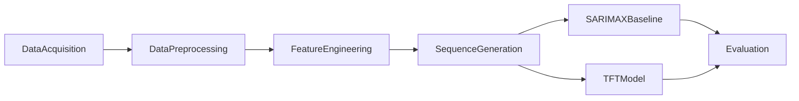

# Evaluating Temporal Fusion Transformers Against SARIMAX Baselines for 60-Day Probabilistic Price Forecasting of Continuous-Cycle Cool-Climate Crops in Sri Lanka

## Research Overview

This repository supports a university research project that compares **Temporal Fusion Transformers (TFT)** with classical **SARIMAX** baselines for **60-day probabilistic** wholesale price forecasting of continuous-cycle cool-climate crops in Sri Lanka. The work targets decision-relevant uncertainty estimates (prediction intervals / quantiles), not point forecasts alone.

The current milestone delivers a clean, research-ready project skeleton: folder structure, configuration, documentation, and stub modules for preprocessing, feature engineering, and evaluation. **Forecasting models are not implemented yet.**

## Research Objective

To design and evaluate a reproducible pipeline that forecasts cool-climate crop prices over a 60-day horizon, and to determine whether TFT improves probabilistic forecast quality relative to SARIMAX under walk-forward evaluation.

## Research Question

How does a Temporal Fusion Transformer compare with SARIMAX baselines for 60-day probabilistic price forecasting of continuous-cycle cool-climate crops in Sri Lanka, in terms of point-forecast error, quantile/interval quality, and statistical significance of forecast differences?

## Proposed Architecture



### Data Acquisition

Collect and organize market price series and relevant external covariates (e.g., weather or calendar signals) into `data/raw` and `data/external`. Datasets are not committed to version control.

### Data Preprocessing

Clean, merge, impute, and temporally synchronize multi-source series via modules under `src/preprocessing/`.

### Feature Engineering

Construct lag, rolling, and calendar/temporal features, then normalize predictors using stubs under `src/features/`.

### Sequence Generation

Convert engineered panels into supervised sequences with a configurable look-back window and 60-day forecast horizon (configured in `configs/config.yaml`). Implementation is reserved for a later milestone.

### Forecasting Models

- **SARIMAX** — classical probabilistic baseline (`src/models/sarimax/`).
- **TFT** — deep probabilistic sequence model via PyTorch Forecasting (`src/models/tft/`).

Both remain placeholders in this milestone.

### Evaluation

Point metrics (MAE, RMSE, MAPE), probabilistic metrics (quantile loss, PICP), walk-forward validation, and Diebold–Mariano tests are stubbed under `src/evaluation/`.

## Planned Tech Stack

| Component | Library |
|-----------|---------|
| Language | Python |
| Data | Pandas, NumPy |
| Classical forecasting | Statsmodels |
| Deep learning | PyTorch, PyTorch Forecasting, Lightning |
| ML utilities | Scikit-learn |
| Visualization | Matplotlib |
| Config / UX | PyYAML, tqdm, Jupyter |

## Project Structure

```text
crop-price-forecasting-tft/
├── data/                  # Raw, processed, and external datasets (gitignored contents)
├── notebooks/             # Reserved for EDA and experiment notebooks
├── src/
│   ├── preprocessing/     # Cleaning, merging, missing values, time sync
│   ├── features/          # Lag, rolling, temporal, normalization features
│   ├── models/
│   │   ├── sarimax/       # SARIMAX baseline (placeholder)
│   │   └── tft/           # Temporal Fusion Transformer (placeholder)
│   ├── evaluation/        # Metrics, walk-forward CV, statistical tests
│   ├── utils/             # Logging and helpers
│   └── main.py            # Pipeline entrypoint stub
├── configs/               # Experiment configuration (YAML)
├── docs/                  # Architecture and methodology notes
├── README.md
├── requirements.txt
├── pyproject.toml
├── LICENSE
└── .gitignore
```

| Path | Role |
|------|------|
| `data/` | Dataset storage; see `data/README.md` |
| `notebooks/` | Exploratory analysis workspace |
| `src/preprocessing/` | Reproducible cleaning and alignment |
| `src/features/` | Feature construction templates |
| `src/models/` | Model packages (documentation only for now) |
| `src/evaluation/` | Metric and validation stubs |
| `src/utils/` | Shared utilities |
| `configs/` | Hyperparameters and path defaults |
| `docs/` | Research architecture and methodology |

## Current Progress

- [x] Repository created
- [x] Folder structure
- [x] Configuration and packaging (`config.yaml`, `pyproject.toml`, `requirements.txt`)
- [x] Data preprocessing module (stubs)
- [x] Feature engineering module (stubs)
- [x] Evaluation module (stubs)
- [x] Documentation (`docs/`, model READMEs)
- [ ] SARIMAX implementation
- [ ] TFT implementation
- [ ] Training pipeline
- [ ] Evaluation experiments and statistical tests

## Future Work

1. Acquire and document Sri Lankan cool-climate crop price series and covariates.
2. Implement preprocessing and feature pipelines end-to-end.
3. Build sequence generation and chronological train/validation/test splits.
4. Implement SARIMAX probabilistic baselines.
5. Implement TFT training/inference with Lightning and PyTorch Forecasting.
6. Run walk-forward evaluation, compute metrics, and apply Diebold–Mariano tests.
7. Document results for the research report / paper.

## License

This project is licensed under the [MIT License](LICENSE).
