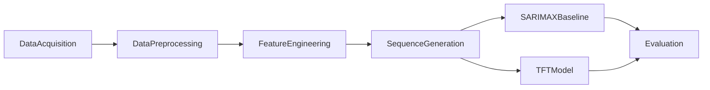

# System Architecture

This document describes the planned software architecture for the crop price forecasting research repository. Model training is **not** implemented in the current milestone; modules exist as stubs and documentation placeholders.

## Pipeline Overview

## Stages

### 1. Data Acquisition

Sources are collected into:

- `data/raw/` — market prices
- `data/external/` — covariates

Raw files remain outside version control.

### 2. Data Preprocessing (`src/preprocessing/`)

Responsibilities:

- Cleaning and deduplication
- Dataset merges and date alignment
- Missing-value handling
- Temporal synchronization / daily resampling

### 3. Feature Engineering (`src/features/`)

Responsibilities:

- Lag features
- Rolling-window statistics
- Calendar / temporal encodings
- Train-only normalization / scaling

### 4. Sequence Generation (future)

Convert engineered panels into supervised sequences using:

- Look-back `window_size`
- Forecast `horizon` of 60 days

Configured in `configs/config.yaml`.

### 5. Forecasting Models (`src/models/`)

| Model | Role | Location |
|-------|------|----------|
| SARIMAX | Classical probabilistic baseline | `src/models/sarimax/` |
| TFT | Deep probabilistic sequence model | `src/models/tft/` |

### 6. Evaluation (`src/evaluation/`)

- Point metrics: MAE, RMSE, MAPE
- Probabilistic metrics: quantile (pinball) loss, PICP
- Protocol: walk-forward validation
- Significance: Diebold–Mariano test

### 7. Entrypoint

`src/main.py` will orchestrate preprocess → features → models → evaluate once implementations land. Today it only logs that the pipeline is a stub.

## Configuration

Central experiment settings live in `configs/config.yaml` (paths, horizon, window size, chronological splits, random seed).

## Design Principles

- Chronological splits only (no random shuffles across time)
- No leakage from future into features or scaling
- Reproducible seeds and versioned configuration
- Clear separation between baseline (SARIMAX) and deep (TFT) code paths
